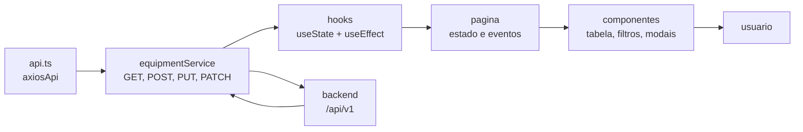
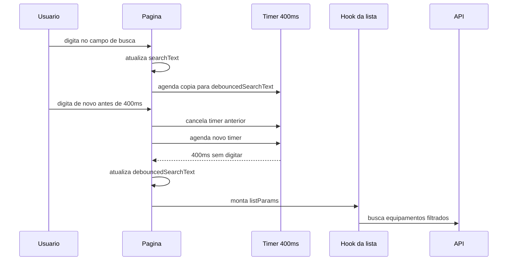
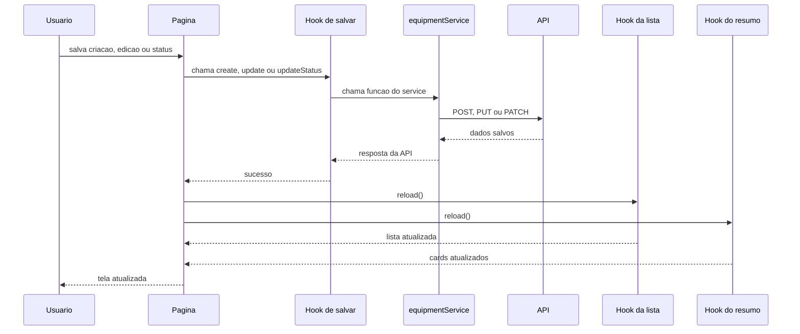

# Aula 07 - Guia do aluno: integração com backend

Nesta aula vamos ligar as telas de Equipamentos na API usando React e Axios:

- `axios`, para fazer as chamadas HTTP;
- `useState`, para guardar dados, loading e erro;
- `useEffect`, para buscar dados quando a tela abrir ou quando filtros mudarem.

A ideia e descomentar/conferir as partes em ordem:

```txt
api.ts -> equipmentService -> hooks -> pagina -> componentes
```

O projeto começa sem chamadas ativas para a API nesta camada.

Os trechos que falam diretamente com a API começam comentados em `api.ts` e no final de `equipmentService.ts`. Antes de cada bloco comentado existe uma explicação curta dizendo o que ele faz.

Hooks, páginas e componentes ficam ativos para a turma conferir o fluxo depois que o service real for descomentado.

## Mapa visual da integração



Leitura rápida:

- `api.ts` guarda o Axios configurado;
- `equipmentService` chama as rotas da API;
- os hooks guardam dados, loading e erro;
- a página decide o que mostrar;
- os componentes só recebem props e disparam eventos.

## Vocabulário rápido

Função assíncrona:

```ts
async function carregarEquipamentos() {
  const response = await axiosApi.get('/equipment')
  return response.data
}
```

Em poucas palavras:

- `async` permite usar `await`;
- `await` espera a resposta da API antes de continuar;
- a tela não trava enquanto a API responde.

Instância:

```ts
export const axiosApi = axios.create({
  baseURL: '/api/v1',
})
```

Em poucas palavras:

- uma instância é uma versão configurada de uma ferramenta;
- `axiosApi` é o Axios já configurado para falar com a nossa API;
- assim não repetimos `/api/v1` em toda chamada.

useEffect:

```ts
useEffect(() => {
  void carregarEquipamentos()
}, [])
```

Em poucas palavras:

- `useEffect` roda depois que o componente aparece na tela;
- usamos para sincronizar a tela com algo externo, como uma API;
- o array `[]` diz quando o efeito deve rodar.

## Antes de comecar

Entre na pasta do frontend:

```bash
cd frontend
```

Rode:

```bash
npm run dev
```

O terminal deve mostrar logs com tags:

```txt
[dev] prepara ambiente, banco e API
[backend] logs da API
[frontend] logs do Vite
```

Abra:

```txt
http://localhost:5173/equipment
```

Swagger:

```txt
http://localhost:3000/docs
```

## Passo 1 - Descomentar o axios base

Arquivo:

```txt
frontend/src/services/api.ts
```

Esse arquivo deve ficar bem pequeno:

```ts
import axios from 'axios'

export const axiosApi = axios.create({
  baseURL: import.meta.env.VITE_API_URL ?? '/api/v1',
})
```

No arquivo, remova os `//` dessas linhas e apague o `export {}` temporário.

O que entender:

- `axios.create` cria uma instancia pronta para chamar a API;
- `baseURL` evita repetir `/api/v1` em todas as chamadas;
- `VITE_API_URL` vem do `.env`;
- se nao existir `.env`, usamos `/api/v1`.

Checkpoint:

```txt
axiosApi.get('/equipment')
```

chama:

```txt
/api/v1/equipment
```

## Passo 2 - Conferir a base da aplicação

Arquivo:

```txt
frontend/src/app/App.tsx
```

Confira se a aplicação continua envolvida pelo Ant Design e pelo React Router:

```tsx
<AntDesignApp>
  <BrowserRouter>
    <AppRoutes />
  </BrowserRouter>
</AntDesignApp>
```

O que entender:

- o `BrowserRouter` habilita as rotas;
- o `AntDesignApp` habilita recursos do Ant Design, como mensagens e modais;
- a integração com API fica nas páginas, hooks e services.

## Passo 3 - Descomentar o service de Equipamentos

Arquivo:

```txt
frontend/src/features/equipment/services/equipmentService.ts
```

O arquivo começa com um placeholder vazio apenas para o TypeScript compilar antes da integração.

Para integrar:

- descomente o import de `axiosApi`;
- descomente o tipo auxiliar `ApiLocation`;
- comente ou remova o placeholder `export const equipmentService = {} as EquipmentService`;
- descomente o bloco final com o service real.

O service real usa `axiosApi`, nao usa `fetch` direto.

Listagem:

```ts
async getEquipmentList(params: GetEquipmentListParams = {}) {
  const response = await axiosApi.get<PaginatedResult<Equipment>>('/equipment', {
    params: {
      page: 1,
      pageSize: 10,
      ...params,
    },
  })

  return response.data
}
```

Resumo:

```ts
async getEquipmentSummary() {
  const response = await axiosApi.get<EquipmentSummaryResponse>('/equipment/summary')

  return response.data
}
```

Detalhe:

```ts
async getEquipmentById(equipmentId: string) {
  const response = await axiosApi.get<EquipmentDetail>(`/equipment/${equipmentId}`)

  return response.data
}
```

Criacao:

```ts
async createEquipment(payload: CreateEquipmentPayload) {
  const response = await axiosApi.post<EquipmentDetail>('/equipment', payload)

  return response.data
}
```

Edicao:

```ts
async updateEquipment(equipmentId: string, payload: UpdateEquipmentPayload) {
  const response = await axiosApi.put<EquipmentDetail>(
    `/equipment/${equipmentId}`,
    payload,
  )

  return response.data
}
```

Status:

```ts
async updateEquipmentStatus(
  equipmentId: string,
  payload: UpdateEquipmentStatusPayload,
) {
  const response = await axiosApi.patch<EquipmentDetail>(
    `/equipment/${equipmentId}/status`,
    payload,
  )

  return response.data
}
```

O que entender:

- `GET` busca dados;
- `POST` cria;
- `PUT` edita;
- `PATCH` altera apenas uma parte;
- `page` e `pageSize` controlam a paginação da listagem;
- `const response = await axiosApi...` espera a API responder;
- `return response.data` entrega para a tela so o corpo da resposta.

## Passo 4 - Conferir os hooks

Arquivo:

```txt
frontend/src/features/equipment/hooks/useEquipmentQueries.ts
```

Tratamento simples de erro:

```ts
export function getRequestErrorMessage(error: unknown) {
  if (axios.isAxiosError(error)) {
    return (
      error.response?.data?.message ??
      error.message ??
      'Não foi possível completar a comunicação com a API.'
    )
  }

  if (error instanceof Error) {
    return error.message
  }

  return 'Não foi possível completar a comunicação com a API.'
}
```

Ideia do hook da listagem:

```ts
export function useEquipmentList(params: GetEquipmentListParams) {
  const { page, pageSize, search, status, type } = params
  const [data, setData] = useState<PaginatedResult<Equipment>>()
  const [isLoading, setIsLoading] = useState(true)
  const [errorMessage, setErrorMessage] = useState('')

  async function loadEquipmentList() {
    setIsLoading(true)
    setErrorMessage('')

    try {
      const result = await equipmentService.getEquipmentList({
        page,
        pageSize,
        search,
        status,
        type,
      })
      setData(result)
    } catch (error) {
      setErrorMessage(getRequestErrorMessage(error))
    } finally {
      setIsLoading(false)
    }
  }

  useEffect(() => {
    void loadEquipmentList()
  }, [page, pageSize, search, status, type])

  return {
    data,
    isLoading,
    errorMessage,
    reload: loadEquipmentList,
  }
}
```

No arquivo final, essa mesma ideia aparece com `useCallback` para manter a função `reload` estável entre renderizações. O fluxo que importa para a aula é:

```txt
liga loading -> chama service -> guarda data ou erro -> desliga loading
```

Hook de criacao:

```ts
export function useCreateEquipment() {
  const [isLoading, setIsLoading] = useState(false)
  const [errorMessage, setErrorMessage] = useState('')

  async function create(payload: CreateEquipmentPayload) {
    setIsLoading(true)
    setErrorMessage('')

    try {
      return await equipmentService.createEquipment(payload)
    } catch (error) {
      setErrorMessage(getRequestErrorMessage(error))
      throw error
    } finally {
      setIsLoading(false)
    }
  }

  return {
    create,
    isLoading,
    errorMessage,
  }
}
```

O que entender:

- `useState` guarda dados, loading e erro;
- `useEffect` chama a API quando a tela precisa carregar dados;
- `reload` permite buscar novamente depois de salvar;
- cada hook devolve uma função simples para a página usar.

## Passo 5 - Conferir a listagem na pagina

Arquivo:

```txt
frontend/src/features/equipment/pages/EquipmentPage/index.tsx
```

Confira os hooks:

```ts
const equipmentListQuery = useEquipmentList(listParams)
const equipmentSummaryQuery = useEquipmentSummary()
const locationOptionsQuery = useEquipmentLocationOptions()
```

Confira os estados da paginação:

```ts
const [searchText, setSearchText] = useState('')
const [debouncedSearchText, setDebouncedSearchText] = useState('')
const [currentPage, setCurrentPage] = useState(1)
const [pageSize, setPageSize] = useState(10)
```

Confira o debounce da busca:

```ts
// Debounce da busca:
// 1. searchText muda a cada tecla digitada.
// 2. esperamos 400ms antes de copiar esse valor para debouncedSearchText.
// 3. como a API usa debouncedSearchText, evitamos uma request a cada tecla.
useEffect(() => {
  // Agenda a atualização da busca para daqui a 400ms.
  const timeoutId = setTimeout(() => {
    setDebouncedSearchText(searchText)
    setCurrentPage(1)
  }, 400)

  // Se o usuário digitar de novo antes dos 400ms, cancelamos o timer anterior.
  return () => clearTimeout(timeoutId)
}, [searchText])
```

O que entender:

- `searchText` muda a cada tecla;
- `debouncedSearchText` muda só depois de 400ms sem digitar;
- a API usa `debouncedSearchText`, então não busca a cada tecla.

Fluxo visual do debounce:



Confira os parâmetros enviados para a API:

```ts
const listParams = {
  search: debouncedSearchText,
  status: selectedStatus,
  type: selectedType,
  page: currentPage,
  pageSize,
}
```

Confira os dados:

```ts
const equipments = equipmentListQuery.data?.data ?? []
const paginationInfo = equipmentListQuery.data?.meta
const summary = equipmentSummaryQuery.data ?? emptySummary
const locationOptions = locationOptionsQuery.data ?? []
```

Confira a paginação da tabela:

```ts
pagination={{
  current: currentPage,
  pageSize,
  total: paginationInfo?.total ?? 0,
  onChange: handlePageChange,
}}
```

Confira loading e erro:

```ts
const isLoading =
  equipmentListQuery.isLoading ||
  equipmentSummaryQuery.isLoading ||
  locationOptionsQuery.isLoading

const loadError =
  equipmentListQuery.errorMessage ||
  equipmentSummaryQuery.errorMessage ||
  locationOptionsQuery.errorMessage
```

Checkpoint:

- a tabela carrega equipamentos reais;
- a tabela pagina usando o `meta.total` da API;
- os cards mostram totais reais;
- filtros disparam nova busca;
- se a API falhar, aparece mensagem simples.

## Passo 6 - Conferir detalhe

Arquivo:

```txt
frontend/src/features/equipment/pages/EquipmentDetailsPage/index.tsx
```

Confira o ID da rota:

```ts
const { equipmentId } = useParams()
```

Confira os hooks:

```ts
const equipmentQuery = useEquipmentDetails(equipmentId)
const locationOptionsQuery = useEquipmentLocationOptions()
```

O que entender:

- `equipmentId` vem da URL;
- `useEquipmentDetails` busca um equipamento;
- `isLoading` mostra carregamento;
- `errorMessage` mostra erro simples.

Checkpoint:

- clique em `Visualizar`;
- troque o ID da URL para um valor invalido;
- confira a tela de erro.

## Passo 7 - Conferir criacao e edicao

Na pagina de listagem, confira:

```ts
const createEquipment = useCreateEquipment()
const updateEquipment = useUpdateEquipment()
```

Criacao:

```ts
await createEquipment.create(payload)
```

Edicao:

```ts
await updateEquipment.update({
  equipmentId: equipmentInForm.id,
  payload,
})
```

O que entender:

- `create` faz `POST`;
- `update` faz `PUT`;
- depois de salvar, a página chama `reload` para recarregar lista e resumo.

Checkpoint:

- crie um equipamento;
- edite o nome ou responsavel;
- confira a tabela atualizada.

## Passo 8 - Conferir alteracao de status

Confira o hook:

```ts
const updateEquipmentStatus = useUpdateEquipmentStatus()
```

Confira o envio:

```ts
await updateEquipmentStatus.updateStatus({
  equipmentId: equipmentInStatus.id,
  payload: {
    status: values.status,
    note: values.note?.trim() || null,
  },
})
```

O que entender:

- status usa `PATCH`;
- a observacao vira `note`;
- depois de salvar, a tela chama `reload` para buscar os dados atualizados.

Checkpoint:

- altere o status;
- abra o detalhe;
- confira o historico recente.

Fluxo visual depois de salvar:



O ponto principal: depois de alterar dados no backend, a página chama `reload` para buscar novamente o que mudou.

## Projeto final: Localizacoes

No projeto final, repita o mesmo padrao:

```txt
api.ts -> locationService -> hooks -> pagina -> componentes
```

Entrega esperada:

- service de localizacoes usando `axiosApi.get`, `axiosApi.post`, `axiosApi.put`, `axiosApi.patch`;
- hooks usando `useState` e `useEffect`;
- tratamento simples com `errorMessage`;
- loading;
- erro;
- estado vazio;
- criacao, edicao, detalhe e status.

## Resumo

Voce precisa sair sabendo explicar:

- por que usamos `axios.create`;
- por que o service nao deve ficar dentro da pagina;
- como `useEffect` busca dados da API;
- como `useState` guarda dados, loading e erro;
- por que chamamos `reload` depois de salvar;
- como o erro vira uma mensagem simples.
