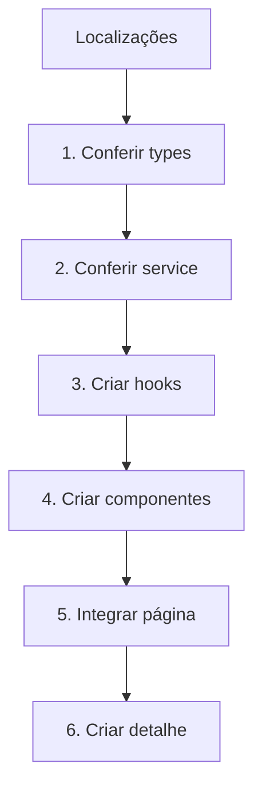
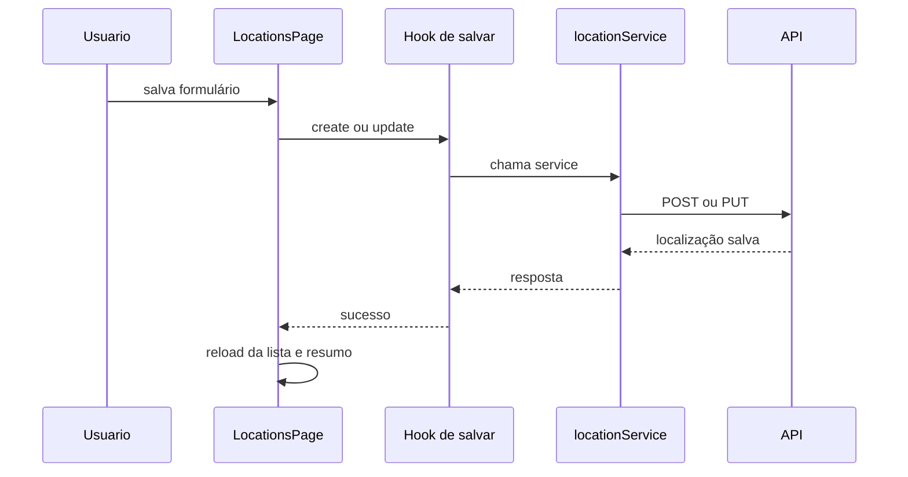

# Aula 08 - Guia do aluno: módulo de Localizações

Nesta aula você vai construir o módulo de Localizações usando Equipamentos como referência.

Equipamentos já está pronto e integrado com a API. Localizações já começa com uma base: listagem, resumo, types, service completo e dois hooks.

## Mapa da implementação



## Arquivos iniciais

```txt
frontend/src/features/locations/types/location.ts
frontend/src/features/locations/services/locationService.ts
frontend/src/features/locations/hooks/useLocationList.ts
frontend/src/features/locations/hooks/useLocationSummary.ts
frontend/src/features/locations/pages/LocationsPage/index.tsx
```

## Passo 1 - Conferir Equipamentos

Antes de mexer em Localizações, confira:

```txt
frontend/src/features/equipment/services/equipmentService.ts
frontend/src/features/equipment/hooks/useEquipmentList.ts
frontend/src/features/equipment/pages/EquipmentPage/index.tsx
```

O padrão que vamos repetir é:

```txt
service -> hook -> página -> componente
```

## Passo 2 - Conferir o service

Arquivo:

```txt
frontend/src/features/locations/services/locationService.ts
```

O service já está pronto para a aula.

Use ele como contrato para criar os hooks e as telas.

Exemplo de detalhe:

```ts
async getLocationById(locationId: string) {
  const response = await axiosApi.get<LocationDetails>(
    `/locations/${locationId}`,
  )

  return response.data
}
```

Exemplo de criação:

```ts
async createLocation(payload: CreateLocationPayload) {
  const response = await axiosApi.post<LocationDetails>('/locations', payload)

  return response.data
}
```

Confira se existem métodos para:

- `PUT /locations/:locationId`;
- `PATCH /locations/:locationId/status`;
- `DELETE /locations/:locationId`;
- `GET /locations/:locationId/equipment`;
- `GET /locations/:locationId/equipment-history`.

## Passo 3 - Criar hooks

Já existem:

```txt
useLocationList
useLocationSummary
```

Crie os próximos espelhando os hooks de Equipamentos:

```txt
useLocationDetails
useCreateLocation
useUpdateLocation
useUpdateLocationStatus
useDeleteLocation
useLocationEquipment
useLocationHistory
```

Use os utilitários compartilhados:

```ts
import type { RequestState } from '../../../shared/hooks/requestState'
import { getRequestErrorMessage } from '../../../shared/http/getRequestErrorMessage'
```

## Passo 4 - Criar filtros

Copie a ideia de:

```txt
frontend/src/features/equipment/components/EquipmentFilters
```

Crie:

```txt
frontend/src/features/locations/components/LocationFilters
```

Campos esperados:

- busca;
- status;
- tipo;
- limpar filtros.

Use:

```ts
locationStatusOptions
locationTypeOptions
getLocationStatusLabel
getLocationTypeLabel
```

## Passo 5 - Melhorar a tabela

A página já tem uma tabela inicial.

Agora transforme essa tabela em componente:

```txt
frontend/src/features/locations/components/LocationTable
```

Use `EquipmentTable` como referência.

Colunas sugeridas:

- localização;
- tipo;
- status;
- prédio;
- sala;
- equipamentos;
- atualização;
- ações.

Ações sugeridas:

- visualizar;
- editar;
- alterar status;
- excluir.

## Passo 6 - Criar formulário

Copie a estrutura de:

```txt
frontend/src/features/equipment/components/EquipmentFormModal
```

Crie:

```txt
frontend/src/features/locations/components/LocationFormModal
```

Campos:

- código;
- nome;
- tipo;
- prédio;
- andar;
- sala;
- descrição;
- status.

## Passo 7 - Integrar criação e edição

Na página de localizações:

```txt
frontend/src/features/locations/pages/LocationsPage/index.tsx
```

Adicione:

- estado para abrir/fechar modal;
- estado para saber se é criação ou edição;
- `useCreateLocation`;
- `useUpdateLocation`;
- `reload` da lista e do resumo depois de salvar.

Fluxo:



## Passo 8 - Alterar status

Copie a ideia de:

```txt
frontend/src/features/equipment/components/EquipmentStatusModal
```

Crie:

```txt
frontend/src/features/locations/components/LocationStatusModal
```

Payload esperado:

```ts
{
  status: values.status,
  note: values.note?.trim() || null,
}
```

## Passo 9 - Excluir localização

Use `DELETE /locations/:locationId`.

A API bloqueia exclusão quando existe equipamento vinculado.

Na tela, mostre a mensagem de erro usando:

```ts
messageApi.error(getRequestErrorMessage(error))
```

## Passo 10 - Criar detalhe

Crie:

```txt
frontend/src/features/locations/pages/LocationDetailsPage
```

Adicione rota:

```tsx
<Route path="/locations/:locationId" element={<LocationDetailsPage />} />
```

Na tela de detalhe, mostre:

- cabeçalho;
- cards de resumo;
- informações gerais;
- equipamentos vinculados;
- histórico de movimentações.

## O que pode virar shared

Pode mover para `shared` quando fizer sentido:

- cabeçalho de página;
- card de resumo;
- card/tabela com borda;
- modal de confirmação;
- badge de status;
- helpers de erro e estado de request.

Regra simples: copie primeiro para aprender; extraia para `shared` quando a repetição estiver clara.

## Checklist final

- filtros funcionam;
- paginação funciona;
- criação funciona;
- edição funciona;
- alteração de status funciona;
- exclusão funciona ou mostra erro da API;
- detalhe carrega pelo ID da URL;
- equipamentos vinculados aparecem no detalhe;
- histórico aparece no detalhe;
- tela tem loading, erro e estado vazio.
